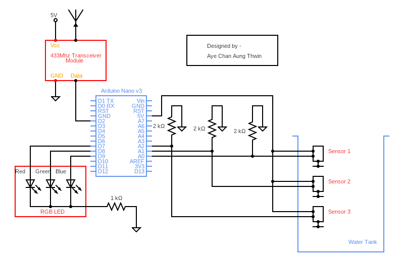
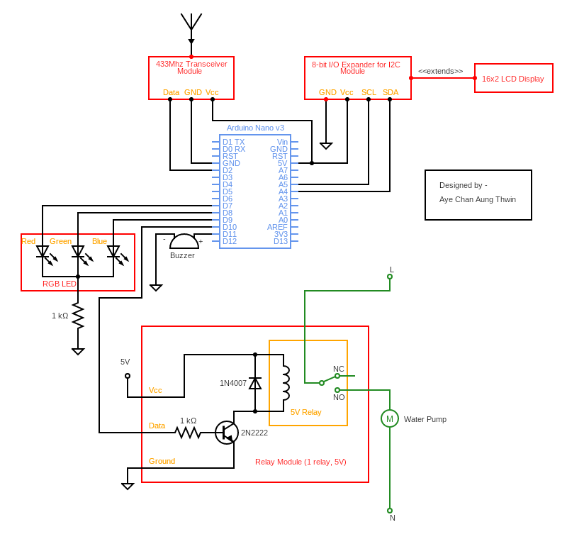

# အလိုအလေျာက် ရေတင်Circuit
## အကျဉ်း
> ဒါကို Arduinoသုံးပြီးရေးထားတာပါ။
> ဒီcircuitက Water Tankနဲ့ ရေဖွင့်ခလုတ် အရမ်းဝေးနေတဲ့ အခြေအနေမှာဆို ကြိုးသွယ်စရာလိုတော့ အရမ်းအဆင်ပြေပါတယ်။
> အောက်ကလင့်ထဲက တစ်ခုခုပျက်သွားရင် "Required-Libruaries-And-Project"ဆိုတဲ့ folderထဲကနေ အကုန်ပြန်ယူလို့ရပါတယ်။ (Videoတော့ မပါပါဘူးဗျ)
> Codeနဲ့ ပတ်သက်လို့ အကောင်းဘက်ကနေ အကြံပေးချင်တာရှိခဲ့ရင် ပြောခဲ့ပါ။

## Circuit Diagrams
> Signalထုတ်လွှင့်အပိုင်း
 
> Signalလက်ခံသည့်အပိုင်း

###### Explanation
- Transmitter Circuitက transmitလုပ်ဖို့အတွက် Sensorကနေထုတ်ထားတဲ့ textတစ်ခုချိန်းတာနဲ့ အဲ့ဒီချိန်းသွားတဲ့ textက 10ကြိမ်တိတိ တူရဲ့လားဆိုတာစစ်ပြီး 10ကြိမ်တိတိတူတယ်ဆိုမှသာ ပြောင်းပေးတာပါ။
- ရေဖြည့်နေချိန်မှာ Sensor Switchက မထိတထိဖြစ်တတ်လို့ အဲ့လိုစစ်ထားတာပါ။
<pre>
Real Time Happening						Filter Result
111								111
011								111
111								111
011								111
011								111
011								111
011								111
011								111
011								111
011								111
011								111
011								111
011								111
011								011
011								011
010								011
</pre>
- Textကို 10ကြိမ်စစ်ထုတ်တဲ့ အပိုင်းမှာဆိုရင် Sensorကနေ HIGHအားလုံးဖြစ်ပြီဆိုတာနဲ့ တပြိုင်နက် filterမလုပ်တော့ဘဲ ခလုတ်ကို ပိတ်ခိုင်းလိုက်တယ်။ ဒါကလည်း လိုအပ်လို့ပါ။ ဒါက C programချည်းပဲမဟုတ်ပါဘူး။ Hardwareနဲ့လည်း ဆိုင်သွားပါတယ်။ ကျွန်တော်က Analog signalsတွေကို A0, A1နဲ့ A2ကို 5Vငုတ်ကနေ တိုက်ပေးထားတာပါ။ ပြီးတော့ အဲ့ ငုတ်တွေကို LOWဖြစ်ချင်ရင် တစ်ငုတ်ချင်းကို 2k resistorနဲ့ Groundချရပါတယ်။ အာ့ကြောင့် Sensorက Closeဖြစ်သွားတဲ့အချိန်မှာ 5Vက analogငုတ်တွေအပြင် groundထဲကိုလည်း ခွဲစီးသွားပါတယ်။ ၃ငုတ်စလုံးကို 5Vဝင်တဲ့အချိန်မှာ voltageကျသွားတဲ့အတွက် filter 10ကြိမ်လုပ်နေစဉ်မှာ HIGHနဲ့ LOWက အမြဲတမ်းဖြစ်ပျက်နေတော့ 10ကြိမ်အတွင်း တူညီတဲ့ textမရတဲ့အတွက် ရေပြည့်သွားလည်း ဖြည့်နေတုန်းပါပဲ။ အဲ့ဒါကြောင့် filter methodထဲမှာ All HIGHအကုန်ရတာနဲ့switchကို ပိတ်ခိုင်းလိုက်တာပါ။ တကယ်ဖြစ်ခဲ့တာပါ။ တစ်ခုရှိတာက 5kသုံးမယ်ဆိုရင်တော့ Groundထဲကို စီးမယ့် currentကနည်းသွားတဲ့အတွက် ဒီပြဿနာတော့ မရှိတော့ပါဘူး။ ဘယ်resistorပဲသုံးသုံး codeချိန်းစရာမလိုပါဘူး။ အဲ့codeကို ဖြုတ်မပစ်ပါနဲ့။ ဘာလို့လဲဆိုတော့ အဲ့codeကပဲ switchကို ပိတ်ဖို့အတွက် ပိုပြီးသေချာအောင် လုပ်ပေးမှာပါ။
- Receiver Circuitဘက်ကတော့ တစ်ဖက်က Circuitပိတ်ထားရင် ပိတ်ထားကြောင်း အသံပေးပါမယ်။ Sensor Errorတက်ရင်လည်း အသံပေးပါမယ်။ ရေတင်ခလုတ်ကို အဖွင့်အပိတ်လုပ်မယ်။ LCDကနေ စာနဲ့ "ရေတင်နေကြောင်း" "တိုင်ကီထဲမှာ ရေဘယ်လောက်ကျန်ကြောင်း" အသိပေးပါမယ်။ ဒါပါပဲ။

###### 433Mhz Transceiver
- (Video) 
   - https://www.youtube.com/watch?v=txSrx5druXg
- (Code - already included in an IDE) 
   - Examples/RadioHead/ask/ask_transmitter
   - Examples/RadioHead/ask/ask_receiver
- (Libruary) 
   - http://www.airspayce.com/mikem/arduino/RadioHead/index.html

###### I2C Adaptor
- (Video) https://www.youtube.com/watch?v=wEbGhYjn4QI&t=1746s
- (Code - Address Scanner) https://playground.arduino.cc/Main/I2cScanner/

###### 16x2 LCD Display
- (Video) https://www.youtube.com/watch?v=wEbGhYjn4QI&t=1746s
- (Video) https://www.youtube.com/watch?v=q9YC_GVHy5A
- (Code - Scrolling text in one line) https://forum.arduino.cc/index.php?topic=422542.0
- (Libruary) https://github.com/fdebrabander/Arduino-LiquidCrystal-I2C-library
